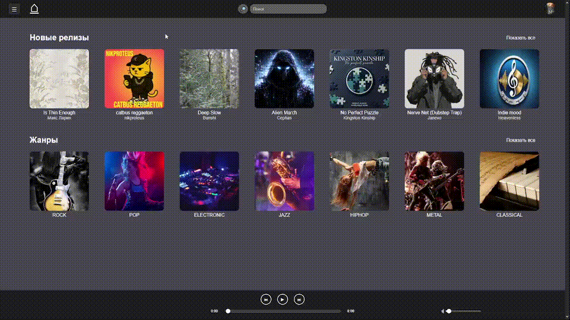
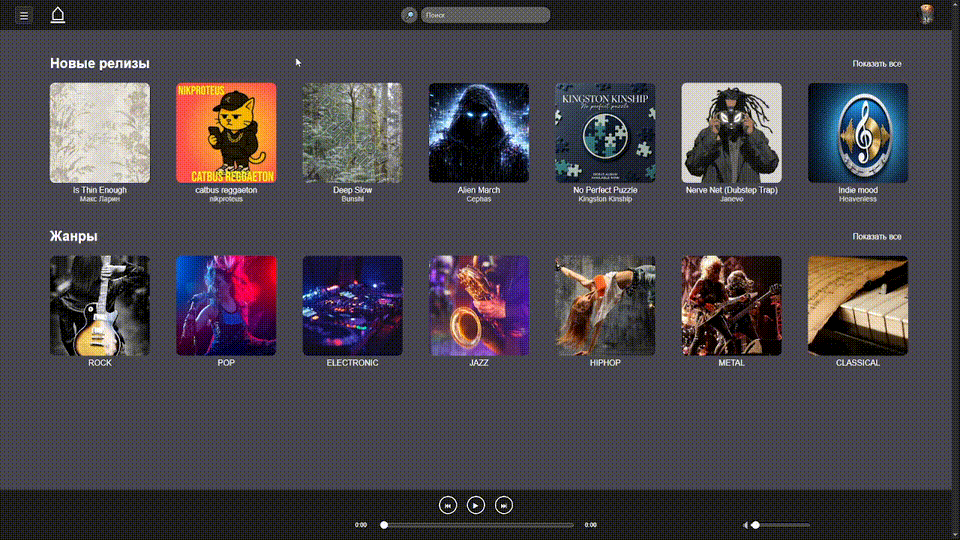
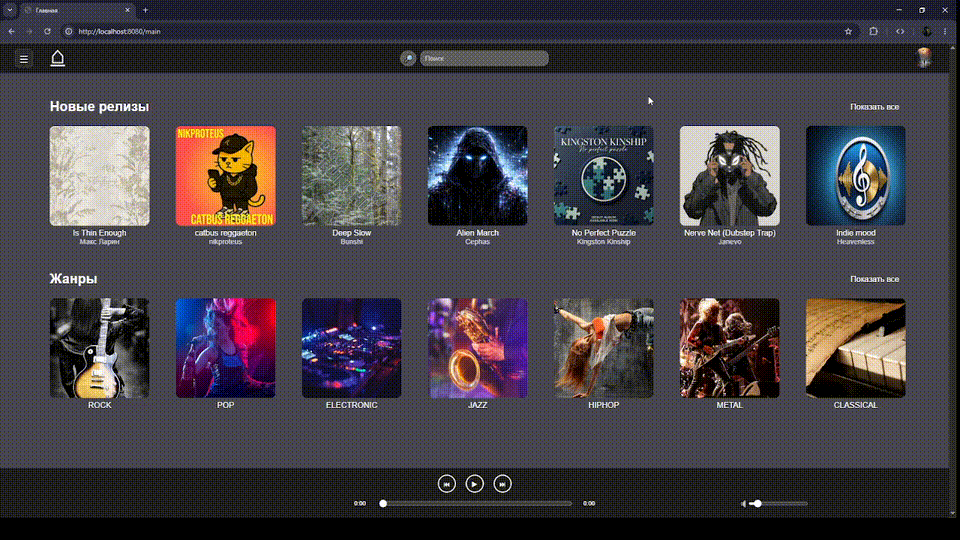
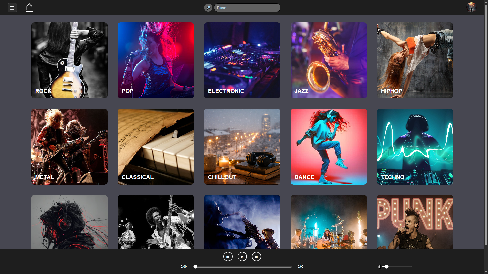

[](https://github.com/pa-parazzi/music_service/actions/workflows/ci.yml)

# 🎧 Music service

A web application for music discovery and personal music management.  
The platform allows users to explore albums, tracks,
and artists by genre and interact with them through likes and personalized music collections.

---

## 📺 Demo

### Album collection
Adding a new album to the collection



### Track collection
Adding a new track to the collection 



### Search
Content search with paginated results


### Authentication flow
Unauthorized users are redirected to the login page when accessing protected collections.



---

## 📷 Screenshots

### Main page


### Album page


### Artist page


### Sound page


### Genre page




### Login page


### Registration page


---

## 🔧 Stack
### Backend

- Java 21
- Spring Boot 3.5
- Spring Security
- Spring Data JPA
- Spring Boot Validation
- Spring Mail

### Frontend

- Vanilla JavaScript
- HTML5 / CSS3

### Database

- PostgreSQL
- Flyway (schema versioning)

### Storage

- Amazon S3 compatible API
  (Yandex Cloud Object Storage via AWS SDK v2)

### Testing

- Spring Boot Test
- JUnit 5
- Testcontainers
- Maven Failsafe
- JaCoCo

### Other

- MapStruct
- Lombok
- ULID

---

## Features

### 🔐 Authentication & Authorization

- User registration and login
- Stateless JWT-based authentication
- Refresh token stored in HttpOnly Secure Cookie
- Automatic access token refresh
- Role-based access control: `USER`, `ADMIN`

### 📫 Email Verification

- Account verification via email confirmation

### 👦 User Interaction

- Like and unlike albums and tracks
- Personal collections management

### 🎼 Music Catalog
- Infinite scroll with server-side pagination
- Navigation between related entities (artists, albums, tracks, genres)
- Detailed views: artist, album, track
- Genre-based filtering
- Keyword search across artists, albums and tracks

### 🎵 Audio Playback
- Track playback
- Album playback
- Client-side state management

### 👤 Admin panel

- Data import from external Jamendo API

---

## 🔨 Architecture
The application follows a client-server architecture with a Single Page Application frontend 
and a stateless REST backend.

### Backend
- Layered architecture (Controller → Service → Repository)
- Clear separation between API layer (DTO) and persistence layer (JPA Entities)
- Transaction boundaries defined at service layer

### Frontend
- Client-side rendered SPA
- Custom router implementation
- Fetch API for REST communication

### ⚙️️ Technical decisions
- **JWT-based authentication with refresh token rotation**<br>
Stateless authentication removes the need for server-side session storage, simplifying horizontal scaling and improving API consistency.
Short-lived access tokens are used for request authorization, while refresh tokens are stored in an HttpOnly Secure cookie to mitigate XSS exposure.


- **S3-compatible object storage**<br>
Used to store core media assets, including audio tracks (MP3) and album artwork, enabling scalable and externalized file storage independent of application instances.


- **Jamendo API**<br>
Used as an external content provider for:<br>
  - Full-length MP3 streaming
  - Album artwork
  - Genre-based filtering and metadata retrieval
  - The free non-commercial tier provides a rate limit of 35,000 requests per month, which is sufficient for development and portfolio-scale workloads.

---

## 🚀 Getting Started

### Requirements
- JDK 21
- Docker (Required for Testcontainers)

### Environment configuration

The application uses externalized configuration via:
- `application.yml`
- environment variables
- optional `.env` file (for local development)

All sensitive values must be provided via environment variables.
For local development, you can create a `.env` file based on `.env.example`
to define the required variables.

### Local database
The application requires PostgreSQL to be installed and running locally.

The database must be created manually (e.g. via pgAdmin 4).

Configuration:
- Host: localhost
- Port: 5432
- Database: MusicService

Credentials are defined in the `.env` file:
- DB_USERNAME
- DB_PASSWORD

### Run locally
```bash
git clone https://github.com/pa-parazzi/music_service.git
cd music_service
./mvnw spring-boot:run
```